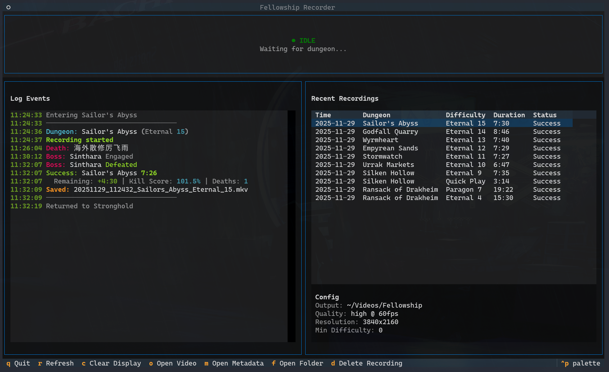

# Fellowship Recorder

Automatically record your Fellowship dungeon runs with automatic detection, chapter markers, and rich metadata.

- This currently only works on Linux
- "Enable Advanced Combat Logs" needs to be enabled within the Gameplay options in Fellowship



## Features

- **Automatic recording** - Detects dungeon start/end from combat logs
- **Smart naming** - `20251125_090352_Urrak_Markets_Eternal_26.mkv`
- **Chapter markers** - Boss encounters and player deaths (requires FFmpeg)
- **Rich metadata** - Party composition, deaths, affixes, difficulty tiers (JSON)
- **Configurable filters** - Record only specific difficulties or skip Quick Play
- **TUI dashboard** - Live status, events, and recordings in a terminal interface
- **Lightweight** - Minimal resource usage, runs in background

## Quick Start

### 1. Install

**Install uv** (if you don't have it):

```bash
curl -LsSf https://astral.sh/uv/install.sh | sh
```

**Install fellowship-recorder:**

```bash
uv tool install fellowship-recorder
```

This automatically handles Python and creates an isolated environment.

**Uninstall:**

```bash
uv tool uninstall fellowship-recorder
```

**System requirements:**

- Linux
- [gpu-screen-recorder](https://git.dec05eba.com/gpu-screen-recorder) (AUR: `yay -S gpu-screen-recorder`)
- FFmpeg (optional, for chapter markers: `sudo pacman -S ffmpeg`)
- Fellowship via Steam/Proton

### 2. Configure

Create a config file at `~/.config/fellowship-recorder/config.toml`:

```bash
mkdir -p ~/.config/fellowship-recorder
curl -o ~/.config/fellowship-recorder/config.toml \
  https://raw.githubusercontent.com/trenchtoaster/fellowship-recorder/main/config.toml.example
```

Edit to set your monitor (find with `hyprctl monitors` or `xrandr`):

```toml
[recording]
monitor = "DP-1"
```

### 3. Run

```bash
fellowship-recorder
```

The TUI dashboard will:

- Monitor your combat logs
- Auto-start recording on dungeon entry
- Auto-stop when complete
- Save with descriptive filename + metadata JSON

## CLI Commands

```bash
# Start the TUI (default)
fellowship-recorder

# Run without TUI (headless mode)
fellowship-recorder --headless

# Parse combat logs (useful for processing existing logs)
parse-log CombatLog.txt --list

# Generate video description from metadata
generate-description video.mkv --output description.txt
```

## TUI Dashboard

The default interface for monitoring recordings in real-time.

**Features:**

- Live recording status with elapsed time
- Current dungeon name and difficulty
- Real-time log events (boss fights, deaths, zone changes)
- Recent recordings list with the ability to open video or metadata files
- Ability to delete a recording and the associated metadata files directly
- Config summary

**Key bindings:**

| Key | Action |
|-----|--------|
| `q` | Quit |
| `r` | Refresh recordings |
| `c` | Clear event log |
| `o` | Open selected video |
| `m` | Open metadata JSON |
| `f` | Open folder |
| `d` | Delete recording and metadata files |

## Output Files

Each recording creates two files:

**Video file** (`.mkv` or `.mp4`):

- Embedded chapter markers for boss fights and deaths
- Metadata tags (dungeon name, difficulty, result)

**Metadata file** (`.json`):

See [CLI Reference](src/fellowship_recorder/cli/REFERENCE.md) for complete documentation.

## How It Works

1. Watches your Fellowship `CombatLogs` directory for changes
2. Parses combat log events (`DUNGEON_START`, `DUNGEON_END`, `ENCOUNTER_START`, `ALLY_DEATH`, etc.)
3. Controls gpu-screen-recorder to start/stop recording
4. Enriches metadata by scanning logs for party info, deaths, and affixes
5. Embeds chapter markers and metadata tags using FFmpeg

## Configuration

Config file locations (searched in order):

1. `~/.config/fellowship-recorder/config.toml` (recommended for installed users)
2. `./config.toml` (project directory, for development)

Edit your config to customize:

**Essential settings:**

- `log_directory` - Fellowship combat logs path
- `monitor` - Display to record (find with `hyprctl monitors` or `xrandr`)

**Recording settings:**

- `resolution`, `quality`, `fps`, `format`
- `audio_device` - Audio source to record (omit or set to `null` to disable audio)

**Filters:**

- `min_difficulty` - Only record dungeons above this difficulty (0 = all)
- `record_quick_play` - Record Quick Play mode (default: false)

**Timing:**

- `dungeon_overrun` - Extra seconds after dungeon ends (default: 5)
- `inactivity_timeout` - Stop after N seconds of no activity (default: 300)

**Chapters:**

- `boss_markers` - Add chapters for boss encounters
- `death_markers` - Add chapters for player deaths
- `chapter_offset` - Offset death markers backward in seconds

See `config.toml.example` for complete documentation.

## Desktop Entry

To add Fellowship Recorder to your app launcher:

```bash
cp contrib/fellowship-recorder.desktop ~/.local/share/applications/
```

## Troubleshooting

See [TROUBLESHOOTING.md](TROUBLESHOOTING.md) for help with common issues.

## Documentation

- [CLI Reference](src/fellowship_recorder/cli/REFERENCE.md) - Detailed CLI tools documentation
- [Game Data Reference](src/fellowship_recorder/mappings/REFERENCE.md) - Difficulty tiers, heroes, dungeons, and affixes
- [Troubleshooting](TROUBLESHOOTING.md) - Common issues and solutions
- [Configuration](config.toml.example) - All configuration options

## Credits

Inspired by [Warcraft Recorder](https://github.com/aza547/wow-recorder) for Windows.

## License

MIT License
